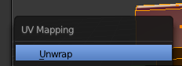
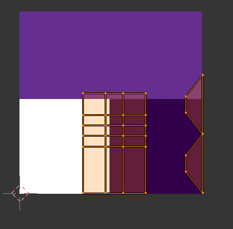
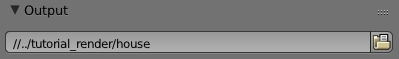
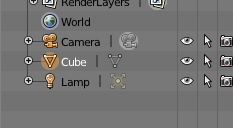
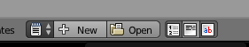
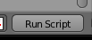
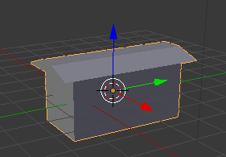
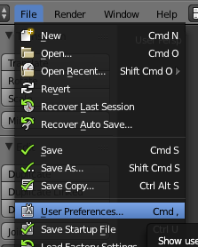
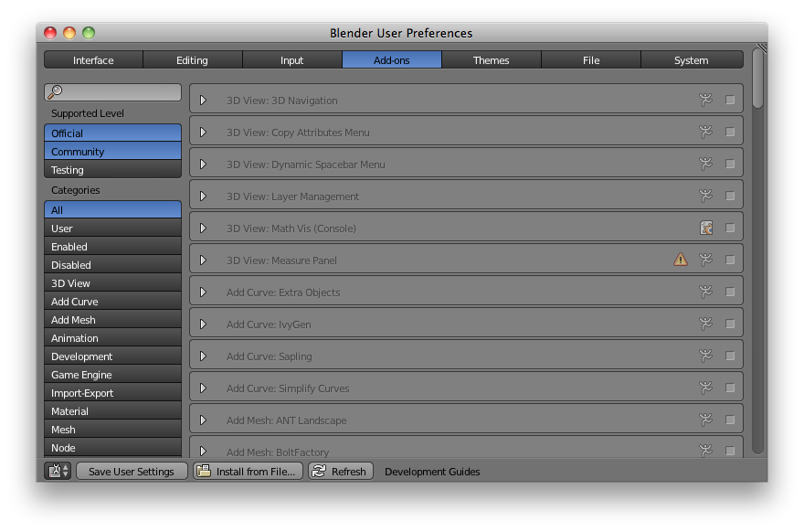
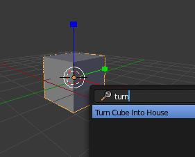

# Intro to Blender

## Quickstart Blender

### Navigating the 3D Scene
* `Middle mouse click` to rotate
* `Middle mouse scroll` to zoom
* `Shift-Middle mouse click` to strafe
* 

### Basic Manipulation
* Press `Tab` key to get into `Edit Mode`
    * 
* Basic manipulation tools are under the Tools panel
    * 
    * Guides can help you `translate`, `scale`, or `rotate`
    * 

### Basic Selection
* `B` and `Left mouse click` to box select
* `A` to toggle between select everything and deselect everything
* `Right` click to select element
* Select `vertex`, `edge`, or `face` by toggling the options
    * 
* `Shift-Right click`

### Model a House
* `Scale` the cube up in the `Y` direction
    * 
* Select the top vertices
    * 
* `Extrude` in the `Z` direction twice
    * 
* `Scale` the top face down in the `X`
    * 
* Select the roof and scale up in the `X` and `Y` direction
    * 
* `Translate` the roof so it sits on top of the house
    * 

### Make Windows
* `Loop cut and Slide` or `Ctrl-R` twice horizontally to create parallel edge loops
    * `Left click` to confirm the orientation of the loop
    * 
    * `Enter` or `Left click` to confirm the location of the loop
    * 
    * `A` to deselect the edge loop after creation
* `Loop cut and Slide` a couple times vertically
    * 
* `Knife` is an alternative to `Loop cute and Slide` for making new edges
    * See `Make a Door` section for `Knife` instructions
* Select a window face and extrude
    * 

### Make a Door
* `Knife` two cuts to create the door outline
    * `Click` to anchor the point
    * 
    * `Enter` to confirm
    * 
* `Extrude` to create a door
    * 

### Render
* Click `Render` to render
    * 
* Adjust the camera if need be
* Change the lamp to `Sun`
    * 
* Change the render to `Cycles Renderer`
    * 
    * 
* Observe the difference between rendering engines
* Click `Save` in the File dropdown
    * Will save as `.blend`
    * 

## Texturing

### Apply Color
* Change the render to `Blender Renderer`
    * 
* Change `Diffuse` color
    * 
* Re-render to see colored house
    * 

### Apply Texture
* In Texture tab, change `Type` to `Image or Movie`
    * 
* Under `Image`, click `Open`
    * 
    * Open `house_texture.jpg`
    * 
* Change the method of display for the 3D view to show 
    * 
* Render
    * 

### Unwrap UVs
* Drag to create another window to improve workflow
    * 
* Set that window to display `UV\Image Editor`
* In the `3D View`, `Tab` into `Edit Mode`
* `A` to select all
    * 
* `U` to bring up UV Map
    * `Unwrap` to unwrap UVs
    * 
    * 
* `U` to bring up UV Map
    * `Smart UV Project` to smartly unwrap UVs
    * 
* Open `house_texture.jpg` as `Image` in `UV\Image Editor`
    * 
    * 
* Select portions of the house in the 3D View and select their equivalent UV
    * 
* Move and scale the UVs to color the house appropriately
    * Use shortcuts for `Translate` (`G`), `Rotate` (`R`), and `Scale` (`S`)

    * 
* Set `Mapping` in `Texture` tab to be `UV`
    * 
* Render
    * 
    * 

## Animation

### Create Animation
* `I` to set keyframe at `0`
    * 
* Move to frame `60` on the Timeline
    * 
* `Rotate` the sun lamp
* `I` to set new keyframe
* Change `Final Frame` to `60`
    * 
* Set the output render directory
    * 
* Render animation
    * 
    * 

### Video Edit
* Set screen layout to `Video Edit`
    * 
* Add `Image`
    * 
    * Navigate to rendered output directory
    * Set `End Frame` to `60`
    * 
    * Select all images in sequence
    * 
* Change `Frame Rate` to `30`
    * 
* Select rendering format
    * Depends on available codecs
    * 
* Render Animation
    * 
    * 

# Intro to Blender API

## Quickstart Blender API (Blender v2.74)

### Setup Environment
* Start the Blender [Console Window](http://wiki.blender.org/index.php/Doc:2.6/Manual/Interface/Window_system/Console_window)
    * In some operating systems, it might require exiting Blender
    * The Console Window is where all the errors and print statements log to
* Set the screen layout to `Scripting`
    * 
    * Python interactive Window (bottom) is a [REPL](https://en.wikipedia.org/wiki/Read%E2%80%93eval%E2%80%93print_loop)
    * 
    * Text Editor (left) is a built-in text editor for running scripts
    * 
    * 3D View (right) is the default 3D View
    * Logger (top) will log UI interactions as API calls with their parameters  
    * 

### Documentation
* [Blender API docs](http://www.blender.org/api/blender_python_api_2_70_release/)
* [Blender User Manual](http://wiki.blender.org/index.php/Doc:2.6/Manual)
* The API docs lists parameters and arguments while the User Manual describes what happens

### Python Interactive Console
* Type `print(hello world)`
    * 
* Make a Cube
    * Start in `Object` mode
    * Delete all existing cubes
    * Hover over the create cube UI (`Create` tab, `Cube` button) will bring up a tool tip with API call
    * 
    * Enter function `bpy.ops.mesh.primitive_cube_add()` in Interactive Console
    * 
    * 
    * Delete the created cube
    * Use the create cube UI to create a cube
    * 
    * Observe the API call with all its parameters are logged
    * 
    * Enter `bpy.ops.mesh.primitive_cube_add(location=(1,2,5))` to create a cube in a different location
    * 
    * Documentation for [primitive_cube_add](www.blender.org/api/blender_python_api_2_70_release/bpy.ops.mesh.html?highlight=primitive_cube#bpy.ops.mesh.primitive_cube_add)

### Accessing Cube
* Delete all cubes in the scene
* Create a new cube
* Observe Cube Object in the Outliner window
    * 
* Click on `+` next to Cube to expand Cube Object
    * The `Cube.xxx` is the name of the Cube Mesh (Mesh is a type of Blender Data Object which holds 3D data)
    * 
* In the Python Interactive Console, access the Cube Object by indexing its name into `bpy.data.objects`
    * 
* In the Console, change the name of Cube
    * 
    * 
    * `Cube` can no longer be accessed from `bpy.data.objects`, instead use `Box`
    * 

### Manipulating Cube
* `mesh = bpy.data.objects['Box'].data` or `mesh = bpy.data.meshes['Cube.005']`
    * 
* `mesh.vertices[0].co` to get the coordinates of the 0th vertex
    * 
* `mesh.vertices[0].co = (5, 1, -1)` to change the coordinate
    * 
    * 

### Text Editor
* Click `New` to create a new Python script
    * 
* Can load existing script with `Open`
    * If you change the original script, loaded script will not update realtime
    * Instead Blender will prompt you to quick reload to sync with your original script
* When you save the `.blend` file, Blender will save a copy of the script at the time
```python
import bpy

bpy.ops.mesh.primitive_cube_add()
```
* Run script
    * 
* Errors and print statements from the Text Editor will be logged to the Console Window

### Making a House
* Every "action" in Blender is an operator call, and they `poll` to determine what mode they're in
    * Some only work in Edit Mode and others in Object Mode
    * Example: `Extrude` only works in Edit Mode and the API call will throw an exception if not in Edit mode
```python
import bpy #Import Blender bpy module
import bmesh #Import Blender bmesh module for selecting verticies

#Expects a cube created around the center (0,0,0) and selected

#Scale body of the house
bpy.ops.object.mode_set(mode="EDIT") #Change into edit mode
bpy.ops.transform.resize(value=(1,2,1)) #Scale up in the Y direction only
bpy.ops.mesh.select_all(action="DESELECT") #Deselect all vertices

#Select the top vertices
#In this case, the top vertices should have z coordinates greater than 0
#Use bmesh, another Blender module, to assign the vertex selection to True
#We select the face, and not the verticies because in the UI,
# the face is autoselected all of its verticies are selected
mesh = bmesh.from_edit_mesh(bpy.context.object.data) #Need to load in context for bmesh
mesh.faces.ensure_lookup_table() #Might be 2.74+ specific
for face in mesh.faces:
    vertices = face.verts
    all_above_zero = True #Only select the face if all its vertices have z > 0
    for vert in vertices:
        x,y,z = vert.co
        if z <= 0:
            all_above_zero = False
    if all_above_zero:
        face.select = True    

#Extrude twice in the Z direction
bpy.ops.mesh.extrude_region_move(TRANSFORM_OT_translate={"value":(0,0,0.3)})
bpy.ops.mesh.extrude_region_move(TRANSFORM_OT_translate={"value":(0,0,0.3)})

#Scale down roof top, the selected vertices, in the X direction
bpy.ops.transform.resize(value=(0.3,1,1)) #Scale down only in X
bpy.ops.mesh.select_all(action="DESELECT") #Deselect all verticies

#Select all the faces associated with the roof
#Same as select roof top, except set a higher cutoff than 0
mesh = bmesh.from_edit_mesh(bpy.context.object.data)
mesh.faces.ensure_lookup_table()
for face in mesh.faces:
    vertices = face.verts
    all_above = True
    for vert in vertices:
        x,y,z = vert.co
        if z <= 1.2:
            all_above = False
    if all_above:
        face.select = True

#Scale up roof
bpy.ops.transform.resize(value=(1.3,1.2,1)) #Scale up in the X and Y direction

#Move roof down
bpy.ops.transform.translate(value=(0,0,-0.3)) #Translate in the Z direction

#Deselect and return to object mode
bpy.ops.mesh.select_all(action="DESELECT")
bpy.ops.object.mode_set(mode="OBJECT")
```
* Run the above script will turn a cube into a house
    * 

### Final Code
* Refactored so it looks a bit nicer
```python
import bpy
import bmesh

def scale_body():
    bpy.ops.object.mode_set(mode="EDIT")
    bpy.ops.transform.resize(value=(1,2,1))
    bpy.ops.mesh.select_all(action="DESELECT")

def select_above(value):
    mesh = bmesh.from_edit_mesh(bpy.context.object.data)
    mesh.faces.ensure_lookup_table()
    for face in mesh.faces:
        vertices = face.verts
        all_above_value = True
        for vert in vertices:
            x,y,z = vert.co
            if z <= value:
                all_above_value = False
        if all_above_value:
            face.select = True    

def extrude_twice():
    bpy.ops.mesh.extrude_region_move(TRANSFORM_OT_translate={"value":(0,0,0.3)})
    bpy.ops.mesh.extrude_region_move(TRANSFORM_OT_translate={"value":(0,0,0.3)})

def scale_down_roof_top():
    bpy.ops.transform.resize(value=(0.3,1,1))
    bpy.ops.mesh.select_all(action="DESELECT")

def scale_up_roof():
    bpy.ops.transform.resize(value=(1.3,1.2,1))

def translate_roof():
    bpy.ops.transform.translate(value=(0,0,-0.3))

def deselect_and_cleanup():
    bpy.ops.mesh.select_all(action="DESELECT")
    bpy.ops.object.mode_set(mode="OBJECT")

scale_body()
select_above(0)
extrude_twice()
scale_down_roof_top()
select_above(1.2)
scale_up_roof()
translate_roof()
deselect_and_cleanup()
```
# Add-Ons
* Add-Ons are additional features that can be loaded and used in Blender
* Blender comes with a large set in `Files` > `User Preferences` > `Add-Ons`
    * 
    * 
* [Example Add-On](http://www.blender.org/api/blender_python_api_2_70_release/info_quickstart.html#example-operator)
* This follow is the above script turned into an Add-On
```python
import bpy
import bmesh

bl_info = {
    "name": "Turn Cube into House",
    "category": "OBJECT",
}

#Subclass Operator to create your own operator (bpy.ops....)
#First comment inside the operator will be the tool tip description
#bl_idname is determines how the operator is invoked
class TurnCubeIntoHouse(bpy.types.Operator):
    """Turn a Cube centered around (0,0,0) into a house"""
    bl_idname = "object.turn_cube_into_house"
    bl_label = "Turn Cube Into House"
    bl_options = {"REGISTER", "UNDO"}
    
    #execute is what happens this operator is called
    def execute(self, context):
        #for simplicity, not going to pass context into the other methods
        #the other methods should act on the given context, instead of
        #fetching the context themselves
        self.scale_body()
        self.select_above(0)
        self.extrude_twice()
        self.scale_down_roof_top()
        self.select_above(1.2)
        self.scale_up_roof()
        self.translate_roof()
        self.deselect_and_cleanup()
        
        #Need to return finished
        return {"FINISHED"}

    def scale_body(self):
        bpy.ops.object.mode_set(mode="EDIT")
        bpy.ops.transform.resize(value=(1,2,1))
        bpy.ops.mesh.select_all(action="DESELECT")

    def select_above(self, value):
        mesh = bmesh.from_edit_mesh(bpy.context.object.data)
        mesh.faces.ensure_lookup_table()
        for face in mesh.faces:
            vertices = face.verts
            all_above_value = True
            for vert in vertices:
                x,y,z = vert.co
                if z <= value:
                    all_above_value = False
            if all_above_value:
                face.select = True    

    def extrude_twice(self):
        bpy.ops.mesh.extrude_region_move(TRANSFORM_OT_translate={"value":(0,0,0.3)})
        bpy.ops.mesh.extrude_region_move(TRANSFORM_OT_translate={"value":(0,0,0.3)})

    def scale_down_roof_top(self):
        bpy.ops.transform.resize(value=(0.3,1,1))
        bpy.ops.mesh.select_all(action="DESELECT")

    def scale_up_roof(self):
        bpy.ops.transform.resize(value=(1.3,1.2,1))

    def translate_roof(self):
        bpy.ops.transform.translate(value=(0,0,-0.3))

    def deselect_and_cleanup(self):
        bpy.ops.mesh.select_all(action="DESELECT")
        bpy.ops.object.mode_set(mode="OBJECT")

def register():
    bpy.utils.register_class(TurnCubeIntoHouse)
    
def unregister():
    bpy.utils.unregister_class(TurnCubeIntoHouse)
    
if __name__ == "__main__":
    register()
```
* Execute the script from the Text Editor
    * Nothing visually will change
    * However, press `Spacebar` and type `Turn Cube into House` will find the newly registered Operator
    * 
    * Clicking on `Turn Cube into House` will turn cube into house
* If you make changes to the Add-On, you need to `unregister` and then `register` again, in the same session

## Repos, Mailing Lists, and IRC
* Feel free to ask questions and contribute!
* [Blender repos](https://developer.blender.org/)
    * C/C++ in Blender Core
    * Python for Add-Ons
* [Mailing lists](http://lists.blender.org/mailman/listinfo)
    * Bf-python
* [IRC lists](http://wiki.blender.org/index.php/Community:Chat)
